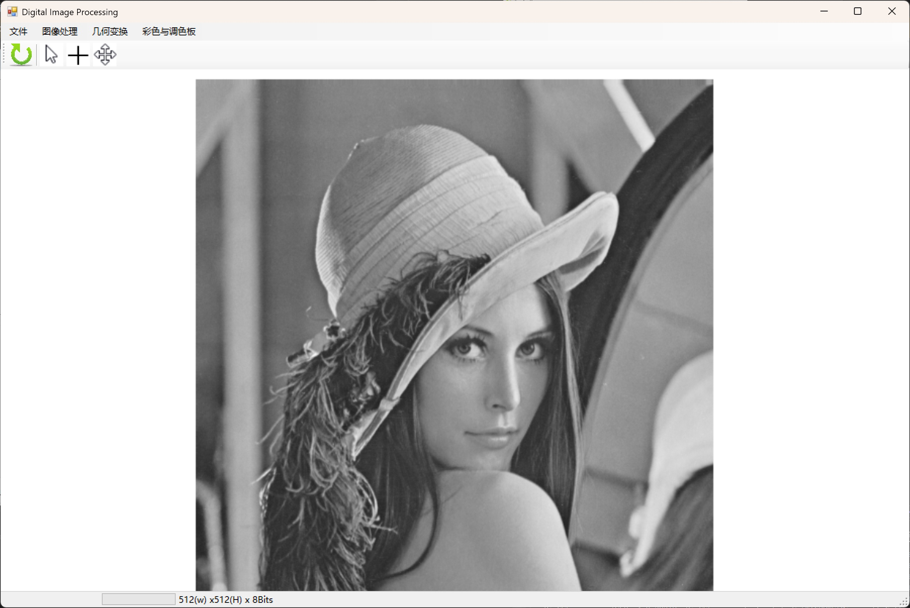

# DipCSharp: Basic Digital Image Processing Tool


An open-source software for editing, analyzing, and transforming digital images with classic algorithms.

## Overview

DipCSharp focuses on the basic comprehension of **D**igital **I**mage **P**rocessing. It provides a pixel-wise processing suite for Bitmap - the image raw data format, including filtering, convolution, geometric transformation, etc. Ideal for researchers and developers working with image data.

<div align=center>
  
</div>

## Key features
- Histogram: analysis, matching, transformations.
- Filtering: gaussian blur, median/average/threshold filtering, gradian filtering.
- Convolution: edge detection (Prewitt, Sobel, Laplace), user-defined convolutional cores.
- Geometric transformation: resize, crop, rotate, mirror.
- Color Space Conversion: RGB, HSV, Grayscale transformations.
- Format Support: BMP

## Quick Started
### Build on your own
```sh
git clone git@github.com:dreamerhuming/DipCSharp.git
cd DipCSharp
# In Visual Studio 2022, open ./DipCSharp.sln
```

## References

### sample images
path to ./samples \
[Sample Images](https://eeweb.engineering.nyu.edu/~yao/EL5123/SampleData.html)
